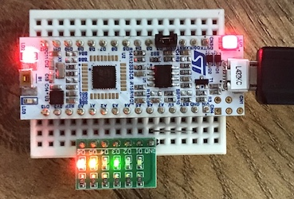

Connect a [Nucleo-L432KC][L432] as follows:

The 6 extra LEDs on A0..A5 each have a series resistor, and A6 is tied to GND.

Type: `pio run` - the LEDs will start blinking, each one at a different rate.

[L432]: https://www.st.com/en/evaluation-tools/nucleo-l432kc.html
